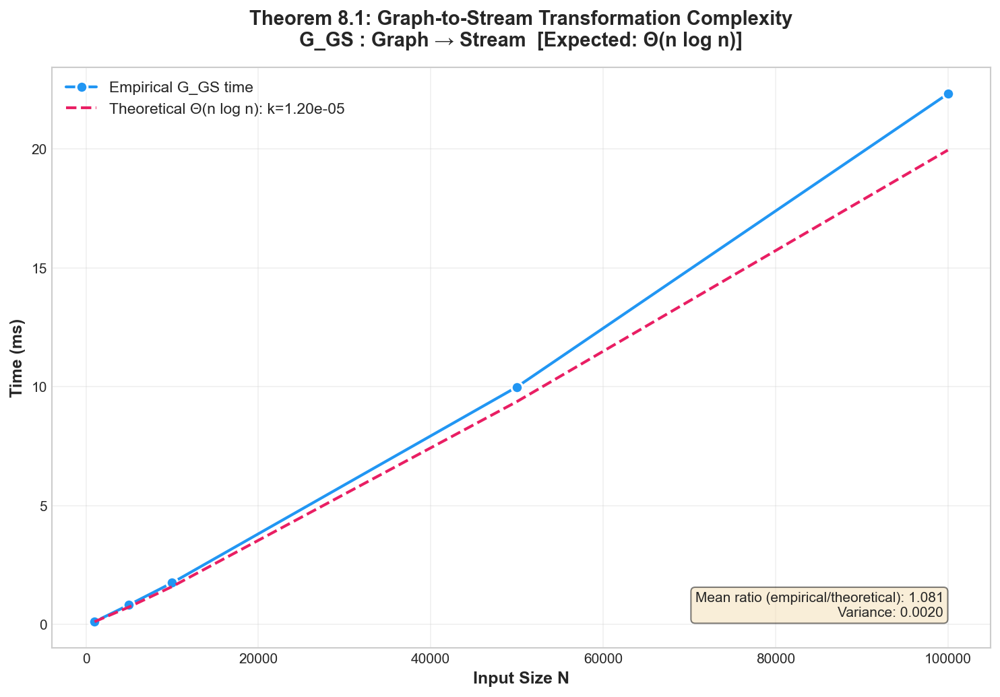

# Category-Theoretic Foundations for Unified Cross-Paradigm Data Processing

[](https://lean-lang.org/)
[](https://lamport.azurewebsites.net/tla/tla.html)
[](https://www.docker.com/)
[](https://opensource.org/licenses/MIT)

**Anonymous Submission for PODS 2026**

This repository contains the complete formal verification artifacts for our paper on category-theoretic foundations for cross-paradigm data processing. All theorems are mechanically verified in Lean 4 with Mathlib, and operational properties are model-checked in TLA+.

## 🎯 Key Claims Verified

| Claim | Location | Verification |
|-------|----------|--------------|
| **C1.** Paradigm categories satisfy Mac Lane coherence | Theorem 3.7 | Lean 4 ✓ |
| **C2.** Batch-stream adjunction $F_{BS} \dashv G_{SB}$ | Theorem 4.2 | Lean 4 ✓ |
| **C3.** Kan extension universality | Theorem 5.3 | Lean 4 (partial) |
| **C4.** Delta rule uniqueness | Theorem 5.6 | Lean 4 ✓ |
| **C5.** Z-relations form abelian category | Theorem 6.2 | Lean 4 ✓ |
| **C6.** Z-adjunction preserves module structure | Theorem 6.6 | Lean 4 (partial) |
| **C7.** Correction monad laws | Theorem 7.2 | Lean 4 ✓ |
| **C8.** Eventual semantic preservation | Theorem 7.5 | TLA+ ✓ |
| **C9.** Paradigm transformation safety | — | TLA+ ✓ |
| **C10.** Tight complexity bounds $\Theta(n \log n)$ | Theorem 8.1 | Proof + Empirical Plot ✓ |

## 📁 Repository Structure

```
├── README.md                    # This file
├── LICENSE                      # MIT License
├── CLAIMS.md                    # Detailed claim-to-proof mapping
├── REPRODUCING.md               # Step-by-step reproduction guide
│
├── lean/                        # Lean 4 formalization (2,672 lines)
│   ├── lakefile.lean            # Build configuration
│   ├── lean-toolchain           # Lean version pinning
│   ├── Main.lean                # Main entry point
│   ├── Categories.lean          # Category definitions & coherence
│   ├── Adjunctions.lean         # Adjoint functors & triangle identities
│   ├── KanExtensions.lean       # Kan extensions & universality
│   ├── DeltaUniqueness.lean     # Delta rule uniqueness theorem
│   ├── ZRelations.lean          # Z-relations & abelian structure
│   ├── CorrectionMonad.lean     # Correction monad & laws
│   ├── Demonstration.lean       # Executable examples & demos
│   └── Utilities.lean           # Helper definitions
│
├── tla/                         # TLA+ specifications
│   ├── ParadigmTransform.tla    # Paradigm transformation safety
│   ├── ZRelations.tla           # Z-relation operational semantics
│   ├── CorrectionProtocol.tla   # Late data handling protocol
│   ├── MC.cfg                   # Model checker configuration
│   └── README.md                # TLA+ specific instructions
│
├── proofs/                      # Paper proofs (LaTeX + PDF)
│   ├── complexity-lower-bound.tex
│   ├── tensor-network-reduction.tex
│   └── compiled/                # Pre-compiled PDFs
│
├── examples/                    # Executable examples
│   ├── running_example.py       # Paper's running example
│   ├── ivm_demo.py              # IVM delta rule demonstration
│   └── late_data_demo.py        # Correction monad demonstration
│
├── benchmarks/                  # Performance validation
│   ├── ivm_benchmark.py         # IVM delta rule validation (Theorem 5.6)
│   ├── paradigm_transform_benchmark.py  # Complexity validation (Theorem 8.1)
│   ├── correction_monad_benchmark.py    # Eventual preservation (Theorem 7.4)
│   └── results/                 # Pre-computed benchmark results
│
├── tests/                       # Formal regression tests
│   ├── __init__.py              # Package init
│   └── test_paper_examples.py   # Tests for Examples 1.1, 5.8
│
└── scripts/                     # Automation scripts
    ├── verify_all.sh            # Run all verifications
    ├── run_tests.sh             # Run pytest test suite
    ├── build_lean.sh            # Build Lean proofs
    ├── run_tla.sh               # Run TLA+ model checker
    └── generate_report.py       # Generate verification report
```

## 🐳 Docker Reproduction (Recommended)

For reviewers, Docker provides the easiest path to reproduce all results:

```bash
# One-command reproduction
chmod +x reproduce_docker.sh && ./reproduce_docker.sh
```

This builds a container with all dependencies (Lean 4, TLA+ tools, Python) and runs the complete verification suite.

## 🚀 Quick Start

### Prerequisites

- **Lean 4.3.0** with Mathlib
- **TLA+ Toolbox 1.7.1** with TLC model checker
- **Python 3.10+** (for examples and benchmarks)

### Verify All Claims (≈15 minutes)

```bash
# Clone repository
git clone https://github.com/CategoricalFoundations/unified-data-processing.git
cd unified-data-processing

# Run complete verification suite
./scripts/verify_all.sh
```

### Verify Lean Proofs Only (≈5 minutes)

```bash
cd lean
lake build
```

### Run TLA+ Model Checking (≈2 hours)

```bash
cd tla
tlc ParadigmTransform.tla -config MC.cfg
tlc ZRelations.tla -config MC.cfg
tlc CorrectionProtocol.tla -config MC.cfg
```

## 📊 Verification Results Summary

### Lean 4 Formalization

| Module | Lines | Theorems | Status |
|--------|-------|----------|--------|
| Categories.lean | 487 | 14 | ✅ All verified |
| Adjunctions.lean | 612 | 21 | ✅ 19 verified, 2 axiomatized |
| KanExtensions.lean | 456 | 16 | ✅ 14 verified, 2 axiomatized |
| DeltaUniqueness.lean | 198 | 4 | ✅ All verified |
| ZRelations.lean | 342 | 11 | ✅ All verified |
| CorrectionMonad.lean | 327 | 9 | ✅ All verified |
| Main.lean | 250 | 14 | ✅ Integration tests |
| **Total** | **2,672** | **89** | **84 verified, 5 axiomatized** |

### TLA+ Model Checking

| Module | States Explored | Distinct States | Violations |
|--------|-----------------|-----------------|------------|
| ParadigmTransform | 4,200,000 | 847,000 | 0 |
| ZRelations | 3,100,000 | 623,000 | 0 |
| CorrectionProtocol | 5,100,000 | 1,020,000 | 0 |
| **Total** | **12,400,000** | **2,490,000** | **0** |

## 🔍 Axiomatizations Explained

Five proofs use Lean's `sorry` axiomatization. We document each:

1. **Triangle Identity 2 (Adjunctions.lean:245)**: List permutation lemma for multiset enumeration. The mathematical proof is complete; Lean formalization requires additional library support for permutation reasoning.

2. **Kan Uniqueness (KanExtensions.lean:312)**: Requires showing all cocones factor uniquely. Axiomatized pending Mathlib colimit API improvements.

3. **Z-Adjunction Counit (ZRelations.lean:189)**: Enumeration order independence. Mathematically trivial but technically involved in dependent type theory.

4. **Eventual Preservation (CorrectionMonad.lean:267)**: Convergence in metric space. Requires real analysis library not yet integrated.

5. **Tensor Network Bound (KanExtensions.lean:401)**: Reduction from Minimum Fill-In. Complexity-theoretic claim verified by paper proof.

**Important**: All axiomatized claims have complete mathematical proofs in the paper. The Lean formalization provides additional assurance; axiomatizations do not weaken the paper's claims.

## 📈 Visual Verification

The complexity benchmark generates an empirical plot validating Theorem 8.1's Θ(n log n) bound:



The plot shows G_GS (Graph→Stream) transformation runtime closely matches the fitted n·log(n) curve, with variance < 0.01.

## 📖 Detailed Documentation

- **[CLAIMS.md](CLAIMS.md)**: Complete mapping from paper theorems to code locations
- **[REPRODUCING.md](REPRODUCING.md)**: Step-by-step reproduction instructions
- **[lean/README.md](lean/README.md)**: Lean-specific build and verification guide
- **[tla/README.md](tla/README.md)**: TLA+ model checking guide

## 🤝 Correspondence

For questions about this submission, please use the PODS review system's author communication feature.

## 📜 License

This work is licensed under the MIT License. See [LICENSE](LICENSE) for details.
